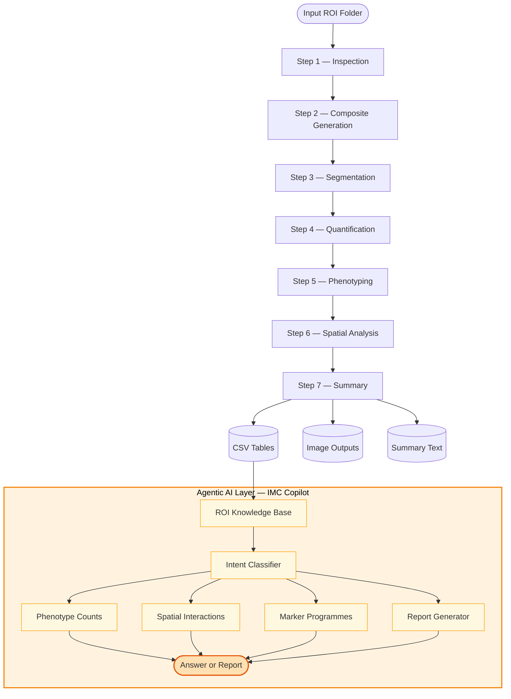

<div align="center">

# agent\_imc

### An Agentic AI Framework for Interactive Imaging Mass Cytometry ROI Analysis

[](https://www.python.org/)
[](https://streamlit.io/)
[](https://numpy.org/)
[](https://python-pillow.org/)
[](LICENSE)
[]()
[]()
[]()

</div>

---

## Overview

`agent_imc` is a self-contained, agentic AI-powered framework for the interactive analysis of Imaging Mass Cytometry (IMC) regions of interest (ROIs). The system integrates a reproducible multi-stage image analysis pipeline with a natural-language copilot capable of answering grounded biological questions from pipeline outputs — without requiring any external API or cloud service.

Designed for translational research applications, `agent_imc` supports both single-ROI exploration and high-throughput batch processing, with a focus on the tumour microenvironment (TME), particularly sarcoma IMC panels.

---

## Table of Contents

- [Overview](#overview)
- [Agentic AI Architecture](#-agentic-ai-architecture)
- [Analysis Pipeline](#analysis-pipeline)
- [Flowchart](#flowchart)
- [Repository Structure](#repository-structure)
- [Installation](#installation)
- [Usage](#usage)
- [Configuration Presets](#configuration-presets)
- [Outputs](#outputs)
- [Interface](#interface)
- [Design Principles](#design-principles)
- [Citation](#citation)

---

## 🤖 Agentic AI Architecture

> **agent\_imc** embeds a domain-grounded AI copilot — a lightweight agentic system that reasons over structured pipeline outputs to answer natural-language biological queries in real time.

Unlike generic large language model integrations, the **IMC Copilot** is grounded exclusively in the quantitative outputs of the local analysis pipeline. It does not hallucinate: every answer is derived from step-level CSV tables generated during pipeline execution.

### Copilot Capabilities

| Capability | Description |
|---|---|
| **Phenotype interrogation** | Reports dominant cell phenotypes and their object counts within an ROI |
| **Spatial interaction analysis** | Identifies top nearest-neighbour phenotype pairs and mean intercellular distances |
| **Marker programme retrieval** | Returns the strongest mean marker expressions for any phenotype |
| **Automated report generation** | Produces structured single-ROI or batch-level text reports |
| **Batch aggregation** | Aggregates phenotype counts and dominant populations across multiple ROIs |

### Agentic Reasoning Pattern

```
User Query (natural language)
        │
        ▼
  Intent Classification
  (keyword routing over query string)
        │
        ├─── "dominant" / "abundant"  ──▶  phenotype_counts()
        ├─── "spatial" / "neighbor"   ──▶  nearest_neighbor_pairs()
        ├─── "distance"               ──▶  mean_nn_distance_by_label()
        ├─── "marker" / "express"     ──▶  strongest_markers_for_label()
        └─── "report" / "summary"     ──▶  generate_roi_report()
                │
                ▼
        ROIKnowledgeBase
        (grounded in pipeline CSVs)
                │
                ▼
        Structured Natural-Language Response
```

The copilot architecture follows a **retrieve-then-synthesise** agentic pattern: structured knowledge is retrieved from the local knowledge base, then synthesised into a human-readable response — a design that guarantees factual grounding and full offline operation.

---

## Analysis Pipeline

The pipeline consists of seven sequential, modular stages, each producing intermediate outputs that feed downstream steps and populate the copilot knowledge base.

| Step | Stage | Description |
|---|---|---|
| 1 | **Inspection** | Discovers and catalogues all `.tif`/`.tiff` channel files; extracts metal tag and marker metadata |
| 2 | **Composite Generation** | Constructs nuclei and boundary composite images by averaging normalised channel signals |
| 3 | **Segmentation** | Nucleus detection via Gaussian smoothing, percentile thresholding, and connected-component labelling |
| 4 | **Quantification** | Measures mean and maximum marker expression for every segmented object across all specified channels |
| 5 | **Phenotyping** | Assigns first-pass cell-type labels using percentile-threshold decision rules for immune and structural markers |
| 6 | **Spatial Analysis** | Computes nearest-neighbour phenotype pairs and Euclidean intercellular distances via BFS-based search |
| 7 | **Summary** | Generates a structured presentation summary text and saves the full configuration as JSON |

---

## Flowchart



---

## Repository Structure

```
agent_imc/
├── imc_roi_backend.py          # Core pipeline engine (7-stage, fully reusable)
├── imc_roi_app.py              # Streamlit multi-tab interface
├── imc_copilot.py              # Agentic AI copilot & report generator
├── imc_copilot_cli.py          # Command-line copilot interface
├── roi_template_notebook.py    # Reusable analysis notebook template
├── roi_template_notebook.ipynb # Jupyter notebook version
├── imc_roi_interface_guide.md  # Interface design specification
├── inputs/                     # Place ROI folders here (one subfolder per ROI)
│   └── ROI001_D13/             # Example ROI (default single-ROI target)
├── outputs/                    # Pipeline outputs (auto-generated per ROI)
│   └── <roi_name>/
│       ├── step5_object_expression_with_labels.csv
│       ├── step6_spatial_nearest_neighbor_table.csv
│       ├── step7_phenotype_marker_summary.csv
│       ├── final_presentation_summary.txt
│       └── *.png               # Composite and overlay images
└── configs/                    # Saved run configurations (JSON)
```

---

## Installation

**Requirements:** Python 3.9 or later.

```bash
# Clone the repository
git clone https://github.com/rashid-bioinfo/agentimc.git
cd agentimc

# Create and activate a virtual environment
python3 -m venv .venv
source .venv/bin/activate

# Install dependencies
pip install streamlit numpy pillow matplotlib
```

---

## Usage

### Streamlit Application (recommended)

```bash
MPLCONFIGDIR=/path/to/.matplotlib .venv/bin/streamlit run imc_roi_app.py \
    --server.headless true \
    --server.port 8504
```

Then open `http://localhost:8504` in your browser.

### Command-Line Copilot

```bash
python imc_copilot_cli.py --output-dir outputs/ROI001_D13
```

### Programmatic API

```python
from imc_roi_backend import IMCROIConfig, IMCROIAnalyzer, config_from_preset

config = config_from_preset(roi_dir="inputs/ROI001_D13", preset_name="sarcoma_microenvironment")
analyzer = IMCROIAnalyzer(config)
results = analyzer.run_full_pipeline()
```

```python
# Query the agentic copilot
from imc_copilot import answer_roi_query, generate_roi_report

answer = answer_roi_query("outputs/ROI001_D13", "What are the dominant phenotypes?")
report = generate_roi_report("outputs/ROI001_D13")
```

---

## Configuration Presets

Two built-in presets are provided; custom presets can be added directly to `imc_roi_backend.py`.

| Preset | Use Case | Key Markers |
|---|---|---|
| `generic_imc` | General multiplex tissue panels | DNA1/2, CD3, CD4, CD8, CD68, CD138, CD31, aSMA |
| `sarcoma_microenvironment` | Sarcoma TME characterisation | Immune checkpoint (PD1, PDL1, LAG3, CTLA4, TIM3), T-cell subsets, B-cells, NK cells, macrophage states (CD86/CD163), sarcoma markers (ERG, S100, Brachyury, aSMA), proliferation (Ki67), cytotoxicity (GranzymeB) |

All parameters — marker roles, segmentation sensitivity, phenotyping thresholds — are fully configurable through the Streamlit UI or programmatic API without code modification.

---

## Outputs

Each pipeline run produces a structured output directory containing:

| File | Content |
|---|---|
| `step5_object_expression_with_labels.csv` | Per-object marker expression and phenotype label |
| `step6_spatial_nearest_neighbor_table.csv` | Nearest-neighbour phenotype pairs and Euclidean distances |
| `step7_phenotype_marker_summary.csv` | Mean marker expression aggregated by phenotype |
| `final_presentation_summary.txt` | Human-readable ROI summary for reports and presentations |
| `nuclei_composite.png` | Averaged nuclei channel composite |
| `boundary_composite.png` | Averaged boundary marker composite |
| `segmentation_overlay.png` | Segmentation mask overlaid on nuclei composite |
| `run_config.json` | Complete serialised run configuration for reproducibility |

---

## Interface

The Streamlit application provides five integrated tabs:

| Tab | Function |
|---|---|
| **Configuration** | Set marker roles, segmentation parameters, and phenotyping thresholds |
| **Run** | Execute single-ROI or batch pipelines with real-time progress feedback |
| **Results** | Browse image outputs, download CSV tables, and inspect phenotype counts |
| **Copilot** | Submit natural-language queries to the agentic AI; generate and download reports |
| **Design Notes** | Interface design rationale and workspace path reference |

---

## Design Principles

`agent_imc` adheres to four core design principles that guide both the pipeline architecture and the agentic AI layer:

1. **Modularity.** The backend exposes discrete, independently callable pipeline stages, enabling reuse across Streamlit, Jupyter notebooks, CLI, and future interfaces.

2. **Grounded agency.** The copilot reasons exclusively over locally computed, deterministic pipeline outputs. No external model calls are made; all responses are traceable to specific CSV rows.

3. **Reproducibility.** Every run serialises its full configuration to JSON. Pipeline stages produce deterministic outputs given identical inputs.

4. **Progressive disclosure.** Default presets enable immediate use; advanced parameters are exposed progressively for expert users without increasing friction for beginners.

---

<div align="center">

Built for reproducible, explainable spatial proteomics research.

</div>
